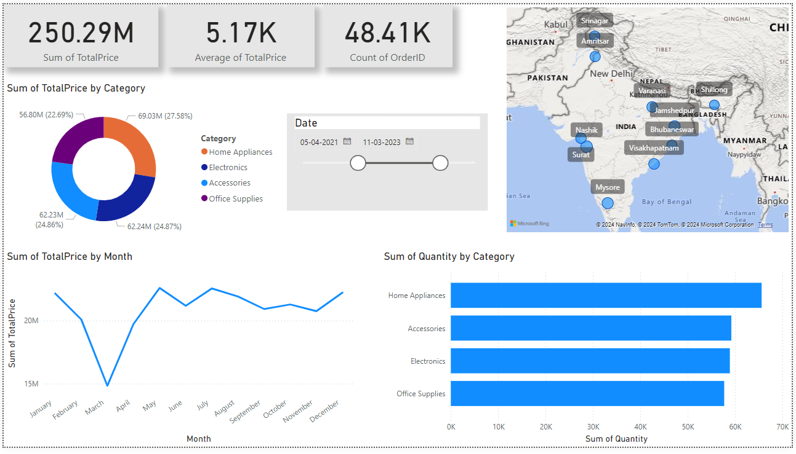

# PowerBI-Dummy-Data-Analytics

## Dashboard Preview

## Project Overview
This repository contains a Power BI dashboard that demonstrates data visualization and analytics skills using a **dummy dataset** generated through Python. The dashboard provides insights into **sales, customer behavior, product performance**, and **order trends**. This project was developed as part of my Power BI learning and practice.

## Dataset Information
The dataset simulates a real-world business scenario with customers, products, and order data:
- **Customers**: 1,000 customers from various cities in India.
- **Products**: 500 products across categories such as electronics, accessories, home appliances, and office supplies.
- **Orders**: 100,000 orders placed between January 2020 and December 2023.

### Data Sources:
1. **Customers Table**: Contains Customer ID, Customer Name, City, and Age.
2. **Products Table**: Contains Product ID, Product Name, Price, and Category.
3. **Orders Table**: Contains Order ID, Customer ID, Product ID, Order Date, Quantity, and Total Price.

## Key Features of the Dashboard
- **Sales Analysis**: Track average order value, Sale per category.
- **Customer Analytics**: Understand customer distribution across cities.
- **Order Trends**: Monitor order volume and product category sales trends over time.
- **Product quantity**: Analyze the total quantity of products.

## Tools Used
- **Power BI**: Used to create interactive dashboards, perform data transformations, and analyze business metrics.
- **Python**: Generated the dummy dataset using pandas and numpy libraries to simulate realistic data.

## How to Use
1. Download the `.pbix` file from the repository.
2. Open the file using Power BI Desktop.
3. The dashboard can be customized with your own data by modifying the dataset in Power BI.

## File Contents
- `Customers_new.csv`: Contains the customer data.
- `Products_new.csv`: Contains the product data.
- `Orders_new.csv`: Contains the order data.
- `Sales_Customer_Dashboard.pbix`: Power BI report file with interactive visualizations.

## Project Impact
This project highlights how businesses can turn raw data into valuable insights using **Power BI**. It showcases my ability to generate a dataset, build a dashboard, and interpret key metrics to drive business decisions.

## Contact
For more information or queries, feel free to contact me:
- **Name**: Trisha Pal
- **Email**: [trishapal845@gmail.com](mailto:trishapal845@gmail.com)
- **LinkedIn**: [linkedin.com/in/trisha-pal-836866240](https://linkedin.com/in/trisha-pal-836866240)

---

**Note**: The dataset used is artificially generated for practice purposes and does not represent real business data.
